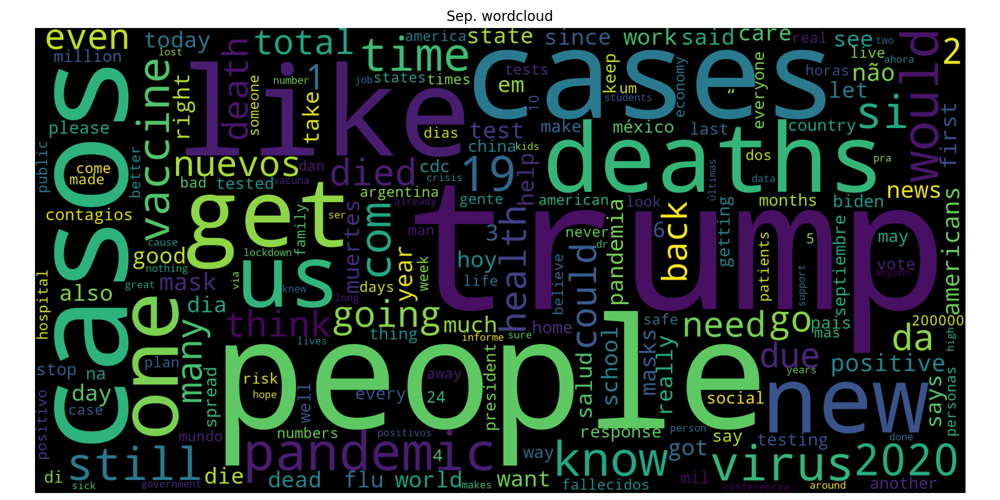
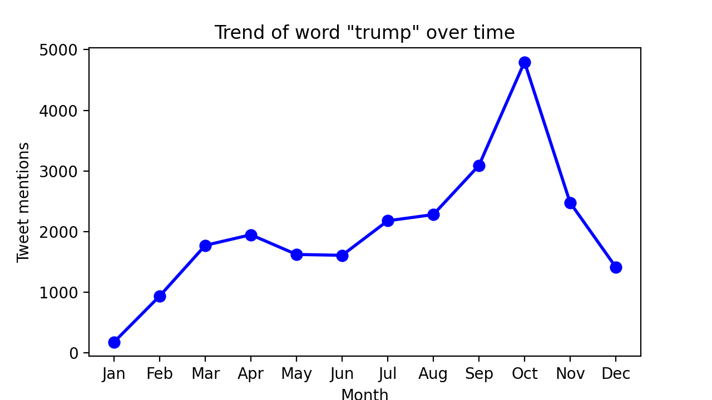
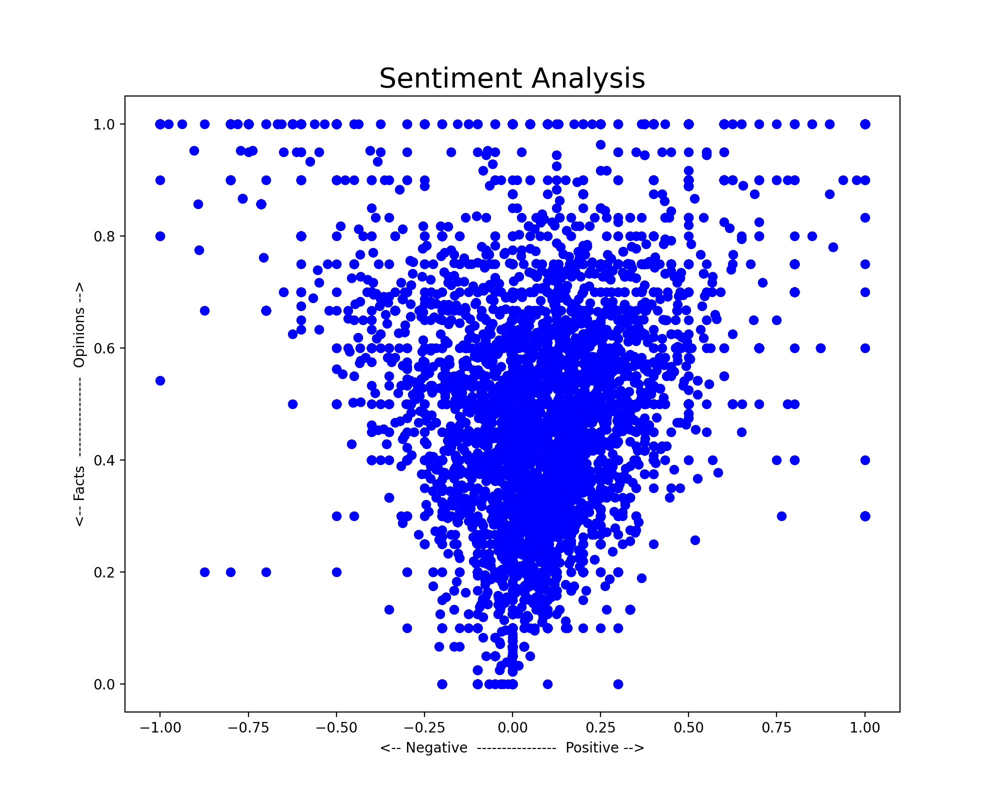
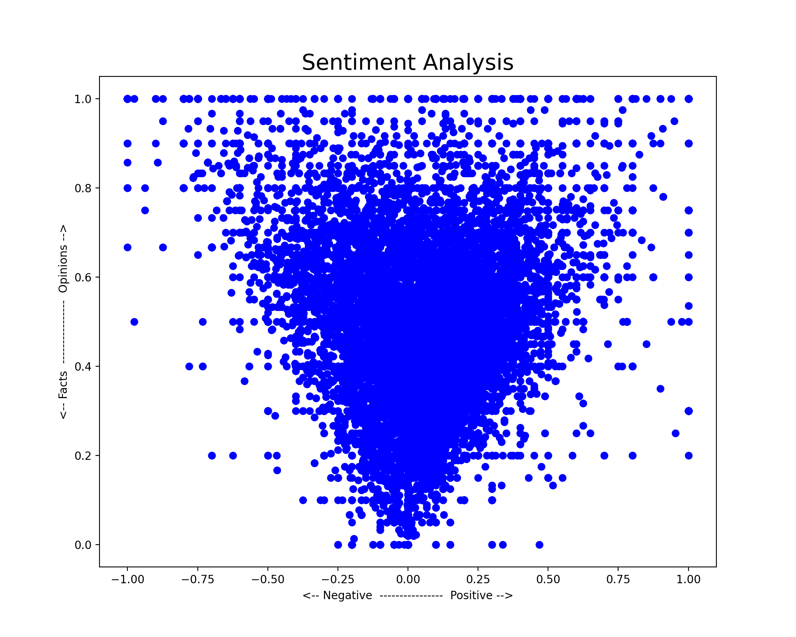
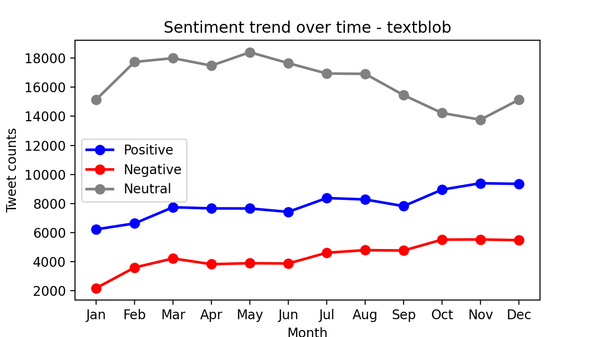
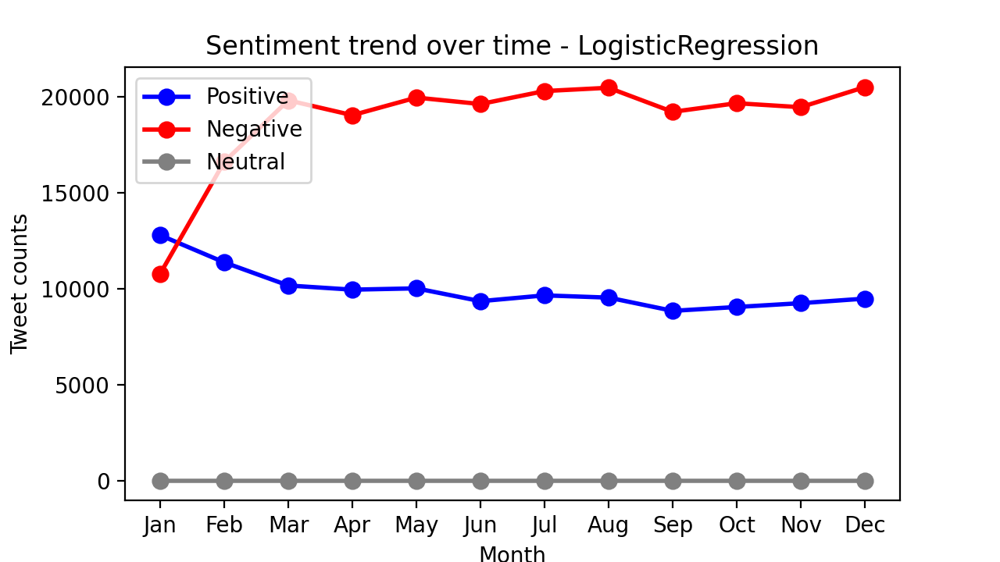

# COVID Twitter Trends

## 1. Data scrapping

### 1.1 snscrape
snscrape is a command line utility which allows scrapping of tweets from twitter and return a list of URLs corresponding to the specific tweets. The library does not have a proper Python based library and hence this part was done using CLI only.

A shell script (`0-twitter-links-script`) was made in order to facilitate the use of snscrape. 

```sh
snscrape --max-results $limit twitter-search "$keyword since:2020-$i-$j until:2020-$i-$(expr $j + 1)" 
```

`keyword` corresponds to a string which needs to be present in the tweets we wish to extract. We need to lookup tweets related to the covid-19 pandemic, so we can define `keyword` as `"covid OR covid-19 OR coronavirus"` We want to extract tweets per day, and so we use `i` and `j` variables to control the particular month and day respectively. The command will be extracting tweets between `j`th day and `j+1`th day, limited by the number `limit` (say, no more than 1000 tweets per day). These tweets will be forwarded to a `txt` file.

### 1.2 Tweepy

We used the `snscrape` to obtain the URLs of the relevant tweets. Using these URLs, we can feed them to a Python library called Tweepy, through which we can extract information from the tweets URLs like the tweet itself, likes, retweets, timestamp, etc.

We extracted the following metadata:
`tweet_id`, `screen_name`, `tweet`, `date`, `likes`, `retweets`

The data was then exported to a CSV file, each for a specific month.

<br>

## 2. Exploratory Data Analysis

Some remarks regarding data extraction/cleaning:

* January month has the least number of tweets related to the keyword `'covid'`. Most of them are tweets where the name of the user had the word `'covid'`, and was often not even related to the pandemic.

* Earlier we had only used the keyword `coronavirus` while scrapping tweets. It was later decided to include a few more keywords - `"covid OR coronavirus OR covid19 OR covid-19"` in order to cover more relevant tweets.

* From the different wordclouds, there were certain words that needed to be removed. Words like `covid`, `coronavirus` would obviously be present in every post, and hence should be suppressed.
    * Removing obvious words like `covid`, `coronavirus`, etc. proved helpful for wordclouds. It's easier to see through the different words.

* Punctuations were removed from the tweets itself, so that 'coronavirus' and 'coronavirus;' are treated as same.
    * There was a slight problem with apostrophe. Apparently, there are 2 types of apostrophes, one is `'` (typewriter apostrophe) and the other is `’`, `‘`, and `´` (opening, closing & acute accent respectively). The later 3 ones are not typically found in most of the modern devices, but they were present in some of the tweets.

* Single letter words like é, u, q, etc. also don't make much sense and hence should be cleansed from the tweets.
* `coronavírus` with this specific `í` should also be removed, after looking at wordclouds and top words list for all months. Apparently, lots of tweets contained this variant spelling of coronavirus.

### Top 10 words per month

|    |  January  | February |  March |   April  |    May   |  June  |  July  | August | September | October | November | December |
|:--:|:---------:|:--------:|:------:|:--------:|:--------:|:------:|:------:|:------:|:---------:|:-------:|:--------:|:--------:|
|  1 |   china   |   china  | people |   trump  |   casos  |  casos | people |  casos |   trump   |  trump  |  people  |  people  |
|  2 |   wuhan   |   cases  |  trump |  people  |  people  | people |  trump | people |   people  |  people |   trump  |  vaccine |
|  3 |    new    |    new   |  virus |    new   |    new   |  cases |  cases |  cases |   casos   |   get   |   cases  |    get   |
|  4 |  outbreak |  people  |   us   |    us    |    19    |  trump |  casos |   one  |   cases   |  cases  |    get   |   like   |
|  5 |   virus   |   virus  |   get  |    19    |   trump  |   new  |   new  |  like  |    like   |   like  |   like   |    new   |
|  6 |  chinese  | outbreak |   si   |   casos  |   cases  |   19   |   get  |   get  |   deaths  |   new   |  deaths  |    one   |
|  7 |   novel   |   wuhan  |  cases | pandemic |    da    |   da   |   us   |   us   |    get    |    us   |    new   |   trump  |
|  8 | pneumonia |    us    |   new  |   cases  |  deaths  |   não  |  like  |  trump |    new    |   one   |    us    |    us    |
|  9 |   cases   |  chinese |  like  |   virus  |    us    |   get  | deaths |  know  |     us    |  would  |    one   |  deaths  |
| 10 |    case   |   news   |   one  |  deaths  | pandemic |  like  |   one  |  2020  |    one    |  casos  |   would  |   cases  |

<br>

### Wordclouds

| | | |
|:-------------------------:|:-------------------------:|:-------------------------:|
| |  ||
|  |  ||
|  |  ||
|  |  ||

Remarks in-relation with pandemic:

* In the initial months of January and February, the word 'china' was trending on twitter and was present in majority of tweets. This is due to the fact that the pandemic started making headlines in the month of January and February when it started spreading in China. This trend gradually started decreasing as the pandemic spread across the world February-March onwards.

<p align="center">

</p>

<br>

* The number of times the word 'trump' mentioned in the tweets (left) *appears to* follow the pandemic trends. It peaked around the month of April, and then once again around July-August, which is the time when 1st wave and 2nd wave of covid cases emerged respectively, as can be compared with the data from JHU (right).

|  |  <p style="font-size: 9px;">image source: https://coronavirus.jhu.edu/map.html</p> |
|:-:|:-:|

<br>

* Although the idea about **vaccine** was there from the beginning, it started trending very quickly in the months of November and December, when the major players like Pfizer, BioNTech, Oxford, AstraZeneca and others started receiving large orders for vaccine doses from various countries.

<p align="center">

</p>

<br>

* The usage of the term **'lockdown'** peaked during 2 regions as highlighted in the picture below. The first region was the time when many countries began imposing lockdown during late February and throughout March. Most of the lockdowns lasted 1-3 months. The second highlighted region was the time when several EU countries began a 2nd lockdown in their respective nations.

<p align="center">

</p>


<br>

## 3. Sentiment Analysis

### 3.1 Using TextBlob library

Sentiment analysis was done using TextBlob library, wherein we got two parameters - polarity and subjectivity. Polarity tells how much positive or negative a sentence is (from +1 to -1 respectively). Subjectivity tells how much a factual or opinionated a sentence is (0 to 1 respectively).

Following are the scatter plots for January and December:

|  |  |
|:-:|:-:|

<br>

* This data looks a difficult to interpret. Lots of tweets are clustered around central region in terms of polarity (Neutral) as well as subjectivity (Neither factual nor opinionated)

A better way would be to look at changing trends of these sentiments. If we classify (0, 1] as positive, [-1, 0) as negative and 0 as neutral, we can plot a line graph from January to December for polarity:

<p align="center">

</p>

* For a given month, the sum of +ve, -ve and neutral tweets would encompass all the tweets (around 30k per month) 

* We see that the number of positive as well as negative tweets overall increased from January to December. This happened at the expense of neutral tweets seeing a declining trend overall.

* The number of so-called 'neutral' tweets are quite subjective, and totally based on TextBlob's interpretation. If a sentence contains both positive as well as neutral sentence, it would put it in the category of neutral (somewhat like the cancelling effect). This technique may or may not be accurate always.

* Although TextBlob can detect and translate tweet, it has to be done explicitly. If a non-English tweet is given, it will put the sentiment score as 0, which *can* be one of the reasons for having so many neutral scores.

* Possible TODO: Translate all the non-English tweets to English using `TextBlob.translte()` (or any other relevant library) and compare.

### 3.2 Using Logistic Regression

Some theory behind logistic regression can be found [here](./extras/THEORY.md).

Sentiment analysis with logistic regression was done by building a model to train.

* Features of each tweet were extracted. Two features were extracted:
    * The first feature is the number of positive words in a tweet.
    * The second feature is the number of negative words in a tweet.
* The +ve and -ve words are determined by a built frequency dictionary 
    * `process_tweet()`: All tweets would be cleaned using NLTK's stopwords, stemmer (`PorterStemmer`) and `TweetTokenizer` (remove @ handles, lowercase words, and reduce length of word by removing repeated chars)
    * Compute a frequency dictionary consisting of each (word, sentiment) pair and its count, with 'word' coming from cleaned tweet (process_tweet), and sentiment value from train data.
    * Use the dictionary to compute the total number of +ve and -ve words

* Gradient descent is applied in order to calculate the weights $\theta$, and the cost function $J$ is minimized.

<p align="center">

</p>

Remarks:

* Tweets having -ve sentiment are than the tweets with +ve sentiment.
* The first 2 months can be ignored, because there weren't enough number of tweets, and so the relative number of +ve and -ve tweets could be dubious in nature.
* The overall +ve sentiment remains more or less same, but the -ve sentiment seems to hav increased slightly between start of the year (March) and end of the year (December).
* 0 neutral tweets probably stems from the fact that we used a logistic sigmoid function to differentiate values above and less than 0.5
    * In contrast to Textblob where there were lots of neutral tweets
    * Non-English tweets were NOT filtered from both analysis. This tells us that Textblob's Pattern library and Linear regression treated and processed them differently